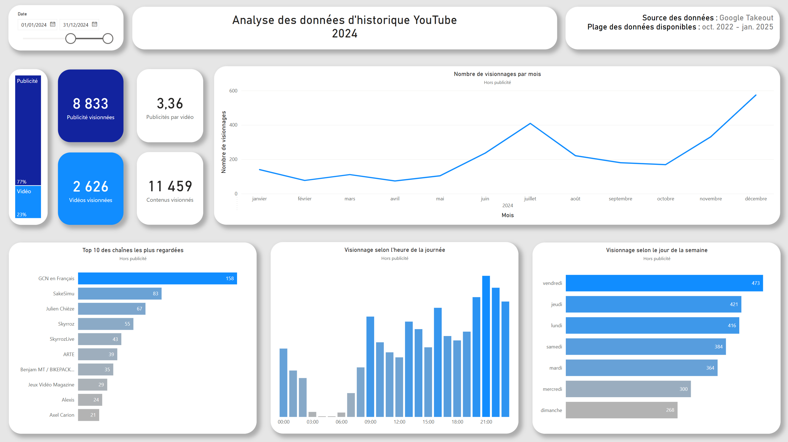

# Analyse de l’historique YouTube

[Lien doc](#)

Dans le cadre d’un travail personnel d’analyse de données, j’ai souhaité expérimenter l’outil **Google Takeout**, voir dans quelle mesure les données allaient être utilisables dans **Microsoft Power BI**, et explorer mes données YouTube par curiosité.

Cette analyse vise à :

- Utiliser l’outil Google Takeout  
- Manipuler les données dans Microsoft Power BI  
- Connaitre mes données en tant qu’utilisateur de YouTube  

## Problèmes identifiés

- Google Takeout offre une large variété de données. Il est essentiel de faire le tri en amont, afin d’extraire uniquement le volume de données nécessaire.  
- Google Takeout permet d’extraire les données en `.csv`, sauf celles qui nous intéressent (historique YouTube) qui sont uniquement fournies en `.json`.  
- Certaines données n’existent pas de base, et le dataset d’origine doit être enrichi pour créer certains insights.  

## Destinataire de l’analyse

- Tout le monde  

## Critères attendus

- Dashboard efficace en termes de lecture (focus sur les grandes informations)  
- Dashboard accessible à tous en termes de compréhension de la data  
- Limiter les informations en ne laissant que les plus importantes, pertinentes pour le plus grand nombre  
- Avoir au moins **1 année complète** de données  

## Données / informations requises

- Nombre de vidéos visionnées  
- Dates des visionnages  
- Type de chaque contenu (vidéo vs publicité)  

## Résultats

## Analyse

### Un volume important de publicités

L’information clé est probablement le rapport entre le nombre de vidéos regardées et le nombre de publicités imposées.  

En 2024, sur la totalité des contenus visionnés (**11 459**), **77 %** étaient des publicités (**8 833**).  
Cela représente une moyenne de **3,36 publicités par vidéo regardée**.  

Chaque publicité comptabilisée dans ce rapport ne signifie pas nécessairement qu’elle a été visionnée entièrement. En effet, certaines publicités peuvent être ignorées. Cela veut donc dire que je n’ai pas réellement regardé **8 833 publicités**.  

Les données recueillies ne contiennent pas d’information sur la durée de chaque vidéo. Il n’est donc pas possible de calculer précisément le ratio entre le temps passé à regarder des publicités et celui consacré aux vidéos.  

Cependant, comme une vidéo dure généralement plus longtemps qu’une publicité, on peut supposer que, même si les publicités sont plus nombreuses, le **temps total passé devant les vidéos reste bien supérieur** à celui passé devant les publicités.  

### Une cartographie de mes centres d'intérêt

2024 est l’année où je me suis mis au **vélo**.  
Dans le **Top 10 des chaînes YouTube les plus regardées**, 3 (dont la #1 *GCN en Français*) sont consacrées au cyclisme.  

6 autres chaînes du Top 10 appartiennent à la catégorie **jeu vidéo**, un autre de mes centres d’intérêt.  

Ces données révèlent une forte corrélation entre les **centres d’intérêt personnels** et les habitudes de consommation sur YouTube.  
Le vélo a eu un fort impact en 2024, mais les contenus liés aux jeux vidéo sont encore plus représentés, ce qui pourrait indiquer un **intérêt de plus longue date** ou un usage plus fréquent.  

### Été, hiver… YouTube au fil des mois

Sur l’année 2024, deux pics de visionnage apparaissent : **juillet** et **décembre**.  

- **Juillet** correspond à une période de congés, marquée par l’essor de mon intérêt pour le cyclisme. J’ai pratiqué ce sport intensément, notamment lors de voyages, et je me suis préparé en regardant des vidéos *tutoriels*.  
- **Décembre** correspond également à une période de congés. L’hiver et les fêtes favorisent une hausse du temps d’écran. Contrairement à l’été où le vélo dominait, l’hiver entraîne un repli vers les contenus liés aux **jeux vidéo**.  

👉 L’été favorise donc le contenu éducatif autour du cyclisme, tandis que l’hiver privilégie les jeux vidéo, avec un visionnage du cyclisme plus **nostalgique ou anticipatif**.  
